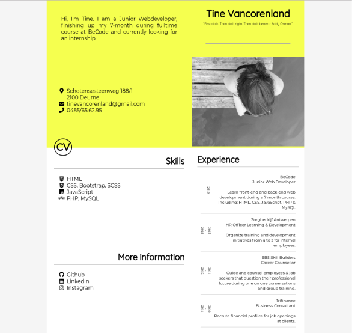

# Writing an article about mobile first 

- we're turning a beautiful chosen cv template in to a mobile first website. 

- two different minds on the same result (Tine Vancorenland)

[link to cv](https://panaddamanarata.github.io/Cv/)

### 1. intro 

Now a days people can search and look for everything they want, where ever they are, when ever they want. 

70% of the online traffic goes through mobile phones. In the early days designers would develop multiple websites to fit desktop, mobile and other screens. Developing and maintaining seperate websites would take a lot of usefull time. That's why we try to design one website, that automatically adapts to the size of your screen. 

As you know, developing a website with HTML, CSS and javascript you can have a hundred different code combinations to make the same outcome. That's why I teamed up with my collegue to make the same cv in our own way. 

We're going to look at the different approach, problems, outcome (little touches to make it our own) in this article. 

#### Panadda - Junior web developer  

if you look at the template you will find the address and contactsection left and the name and picture right. if thinking in mobile first and wanting a nice layout. You'd place your name first and after the picture. 

Thinking about this. A few months ago Tine and I started this 7 month web develepmont work-learning course. With no background ever in development. We began our journey as a web developer. Going into the course we had to make a cv and had the same example we liked but cound't find a right way to make it. I tried this one before and worked so long on it to afterwards just leave it to find a new example to work with. 

Today we're at the end of the course. While still liking this cv example, looking for good projects to send to our potential internships. We descided to give this one another change. Starting from mobile first! Because if you cannot open this beauty on your mobile phone. It would be a waist. 

### Tine - Junior web developer 

